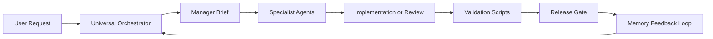
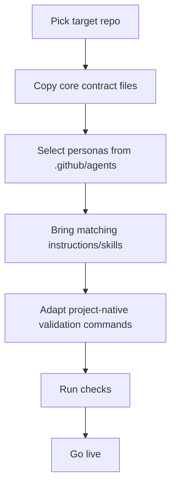

# Copilot-AI-Agent

<p align="center">
  
  
  
  
</p>

<p align="center">
  <b>A high-governance Copilot agent hub to reuse personalities fast, scale execution quality, and keep enterprise control.</b>
</p>

---

## Why this repository exists

`Copilot-AI-Agent` is your **central operating system** for agent personalities.
It lets you bootstrap a new repository in minutes with:

- battle-tested agent personas,
- strict routing and governance,
- validation guardrails,
- reusable skills/prompts,
- memory-based continuous improvement.

If your goal is: **"I want reusable AI specialists ready on day one"**, this repo is the base.

---

## At a glance ✨

| Capability | What you get | Business value |
|---|---|---|
| Reusable personalities | Curated specialist agents under `.github/agents/` | Faster project startup |
| Governance by design | Routing + manager briefs + quality gates | Lower operational risk |
| Portable workflows | Skills/prompts/instructions ready to import | Standardized delivery |
| Validation-first | Python checks and release gates | Safer merges and releases |
| Memory loop | Append-only learning and feedback | Compounding system quality |

---

## Visual architecture



---

## Repository map (what matters first)

```text
AGENTS.md                           # Core operating contract
.github/copilot-instructions.md     # Global Copilot rules
.github/agents/                     # Reusable agent personalities
.github/instructions/               # Path-scoped rules (applyTo)
.github/skills/                     # Multi-step workflows
.github/prompts/                    # Reusable task entrypoints
.github/scripts/                    # Validation, routing, reporting utilities
.github/memory/                     # Append-only learning artifacts
docs/                               # Playbooks and governance guides
examples/                           # Payload and brief templates
```

---

## Quick start (5 minutes)

### 1) Clone

```bash
git clone https://github.com/NAYTOUX/Copilot-AI-Agent.git
cd Copilot-AI-Agent
```

### 2) Validate the hub

```bash
python .github/scripts/validate_copilot_customizations.py
python .github/scripts/run_orchestrator_checks.py
```

### 3) Reuse in a target project

```bash
python .github/scripts/export_agent_hub.py --target C:/path/to/target-repo
```

---

## Fast personality reuse workflow 🚀



### Minimal import set

- `AGENTS.md`
- `.github/copilot-instructions.md`
- `.github/agents/`
- `.github/instructions/`
- `.github/skills/`
- `.github/hooks/`
- `.github/memory/MEMORY_INDEX.md`
- `.github/memory/ORCHESTRATOR_ROUTING_SCORECARD.md`
- `.github/scripts/validate_copilot_customizations.py`

---

## Enterprise operating model

### 1) Routing
- Start with objective + constraints.
- Build a manager brief.
- Delegate to the minimum specialist set.

### 2) Execution
- Implement with narrow scope.
- Keep architecture and naming conventions stable.

### 3) Verification
- Run objective checks.
- Record residual risk explicitly.

### 4) Learning
- Append outcomes into memory artifacts.
- Improve profiles without destructive rewrites.

---

## Validation commands

```bash
python .github/scripts/validate_copilot_customizations.py
python .github/scripts/validate_json_contracts.py
python .github/scripts/validate_agent_relationships.py
python .github/scripts/run_orchestrator_checks.py
python .github/scripts/audit_agent_hub.py
python .github/scripts/prepare_release.py --allow-dirty
```

---

## Visual pack (ready to integrate)

This repository now includes ready-to-use visual sources in:

- `docs/visuals/architecture.mmd`
- `docs/visuals/personality-reuse-flow.mmd`
- `docs/visuals/release-gate.mmd`
- `docs/visuals/governance-raci.mmd`
- `docs/visuals/memory-loop.mmd`

You can paste these Mermaid diagrams into:
- README sections,
- internal runbooks,
- Confluence/Notion pages,
- onboarding decks.

---

## Governance and compliance notes

- No secrets in docs, memory, prompts, or examples.
- Use least privilege for automation/workflows.
- Keep memory append-only.
- Never claim tests/checks that were not executed.

---

## Suggested badges you can add later

- CI status badge
- Release badge
- Coverage badge
- Security scan badge
- Dependency freshness badge

---

## FAQ

### Is this an application framework?
No. It is an **agent governance and reuse hub**.

### Can I use all files as-is in any repo?
You can import quickly, then adapt validation commands to the target repo.

### What is the best entrypoint?
Start with `AGENTS.md`, then `.github/copilot-instructions.md`.

### Is this open-source permissive?
No. This repository uses a proprietary non-commercial license by default.

---

## Ownership

- **Owner:** Maxence Messarra
- **GitHub:** https://github.com/NAYTOUX
- **Repository:** https://github.com/NAYTOUX/Copilot-AI-Agent

---

## License

See `LICENSE.md`.
This project is authored by Maxence Messarra and distributed under a **Proprietary Non-Commercial License**.
Commercial use requires explicit prior written permission.

---

## One-screen executive summary

If you need reusable AI personalities with governance, quality gates, and legal control,
`Copilot-AI-Agent` is your **enterprise-ready base repo**.
