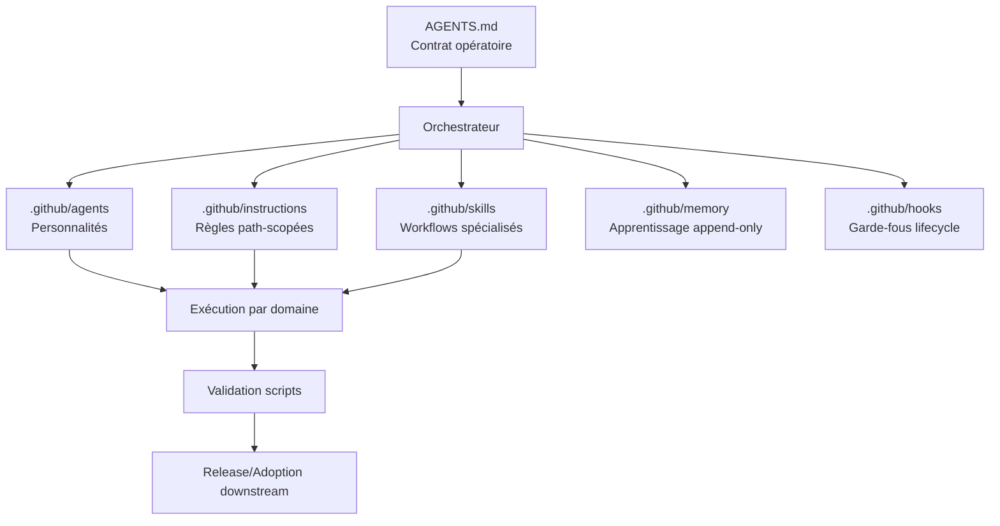

# NAYTOUX/Copilot-AI-Agent

[](#)
[](#)
[](#)
[](#)
[](#)

> **Hub universel d’agents Copilot** pour industrialiser la création, la réutilisation et la gouvernance de personnalités d’agents dans vos futurs projets.

---

## Résumé exécutif

`NAYTOUX/Copilot-AI-Agent` est un référentiel central prêt à l’emploi pour :
- standardiser des **personnalités d’agents** réutilisables,
- orchestrer des workflows de livraison multi-domaines,
- sécuriser la qualité via des **gates de validation**,
- capitaliser l’apprentissage dans une mémoire append-only.

Ce dépôt permet un **démarrage rapide** d’un système d’agents Copilot dans un nouveau repo, avec une gouvernance claire, des instructions path-scopées, des skills métiers, et des scripts de contrôle automatisés.

---

## Proposition de valeur

| Besoin entreprise | Réponse apportée par ce repo | Impact |
|---|---|---|
| Accélérer l’adoption Copilot à l’échelle | Base unifiée (`AGENTS.md`, `.github/instructions`, `.github/skills`) | Time-to-value réduit |
| Réutiliser des personas d’agents dans plusieurs projets | Patterns d’import/export + structure standardisée | Effort de setup minimisé |
| Maîtriser le risque qualité/sécurité | Validation scriptée + règles de gouvernance | Conformité renforcée |
| Capitaliser le savoir d’exécution | Mémoire append-only (`.github/memory`) | Amélioration continue traçable |

---

## Vue d’architecture



---

## Cartographie des composants (dossier → rôle)

| Chemin | Rôle principal | Quand l’utiliser |
|---|---|---|
| `AGENTS.md` | Contrat d’orchestration global | Toujours en premier |
| `.github/copilot-instructions.md` | Règles Copilot transverses | À chaque session |
| `.github/agents/` | Profils d’agents spécialisés | Quand vous créez/ajustez une personnalité |
| `.github/instructions/` | Instructions ciblées par type de fichier (`applyTo`) | Pour imposer des normes localisées |
| `.github/skills/` | Workflows multi-étapes réutilisables | Pour routage/domaines complexes |
| `.github/memory/` | Mémoire append-only & feedback loop | Pour capitalisation inter-session |
| `.github/hooks/` | Guardrails d’exécution et conformité | Pour sécuriser le cycle Copilot |
| `.github/scripts/` | Validation, relay, reporting | Avant merge/release |
| `docs/` | Documentation opérationnelle et gouvernance | Adoption, runbooks, politiques |
| `examples/` | Exemples de payloads/briefs/reports | Bootstrap rapide des intégrations |

---

## Quick Start (réaliste et immédiat)

### Pré-requis
- Git
- Python 3.x
- VS Code + GitHub Copilot

### Démarrage en 5 minutes
- [ ] Cloner le repo
- [ ] Lire `AGENTS.md`
- [ ] Lire `.github/copilot-instructions.md`
- [ ] Lancer les validations de customisation
- [ ] Lancer les checks d’orchestration

```bash
git clone https://github.com/NAYTOUX/Copilot-AI-Agent.git
cd Copilot-AI-Agent
python .github/scripts/validate_copilot_customizations.py
python .github/scripts/run_orchestrator_checks.py
```

---

## Workflow express de réutilisation des personnalités d’agents

### Objectif
Réutiliser rapidement une personnalité d’agent dans un nouveau projet sans reconstruire la gouvernance.

### Processus recommandé
1. **Importer le socle** : `AGENTS.md`, `.github/copilot-instructions.md`, `.github/instructions/`, `.github/skills/`.
2. **Sélectionner les personas** dans `.github/agents/` selon vos cas d’usage.
3. **Conserver les scripts de validation** et adapter uniquement les chemins/commandes projet.
4. **Brancher la mémoire** (`.github/memory/`) en mode append-only.
5. **Valider avant activation** avec les scripts Python natifs du hub.

### Checklist de réutilisation
- [ ] Contrat d’orchestration copié sans altération critique
- [ ] Instructions `applyTo` alignées au nouveau repo
- [ ] Skills pertinents activés (sans surcharge inutile)
- [ ] Hooks/guardrails compatibles workflow local
- [ ] Validation exécutée avec succès

---

## Options d’import/export

| Mode | Description | Avantages | Limites |
|---|---|---|---|
| Import manuel sélectif | Copie ciblée de fichiers/dossiers | Contrôle fin | Plus d’effort initial |
| Import “hub core” | Reprise quasi complète du socle `.github` + `AGENTS.md` | Déploiement rapide | Nécessite harmonisation légère |
| Export de persona | Extraction d’un agent + ses instructions/skills associés | Réutilisation granulaire | Dépendances à vérifier |
| Export de gouvernance | Portage des scripts/checks et docs de process | Uniformité multi-repos | Demande discipline d’exécution |

---

## Gouvernance & workflow de validation

### Standards de contrôle
- Validation des customisations Copilot.
- Vérification des règles d’orchestration.
- Contrôle de cohérence des assets `.github`.

### Commandes de référence
```bash
python .github/scripts/validate_copilot_customizations.py
python .github/scripts/run_orchestrator_checks.py
```

### Gate de qualité (avant merge)
- [ ] Architecture d’agents cohérente
- [ ] Instructions non contradictoires
- [ ] Skills routables et testables
- [ ] Mémoire append-only respectée
- [ ] Documentation alignée sur le comportement réel

---

## Sécurité & confidentialité

| Domaine | Exigence |
|---|---|
| Secrets | Ne jamais exposer tokens, clés privées, variables d’environnement |
| Données privées | Exclusion stricte des payloads sensibles dans docs/memory |
| Mémoire | Politique append-only, pas de réécriture destructive |
| Automatisation | Permissions minimales, contrôles explicites |

**Principe directeur** : aucune fuite de données, aucune validation “déclarative” sans exécution réelle.

---

## Modèle de contribution

### Flux recommandé
1. Créer une branche dédiée.
2. Modifier de façon ciblée (pas de refactor hors périmètre).
3. Exécuter les scripts de validation.
4. Documenter impacts et limites.
5. Ouvrir PR avec justification claire.

### Bonnes pratiques
- [ ] Commits atomiques et message explicite
- [ ] Respect des conventions existantes
- [ ] Traçabilité des décisions dans `docs/` si nécessaire
- [ ] Zéro secret en clair

---

## Roadmap (indicative)

| Horizon | Priorité |
|---|---|
| Court terme | Renforcement des templates d’adoption downstream |
| Moyen terme | Couverture de validation élargie (domaines spécialisés) |
| Moyen terme | Catalogue de personnalités enrichi avec métriques d’efficacité |
| Long terme | Gouvernance adaptive cross-repo avec feedback loops automatisés |

---

## FAQ

### Ce repo est-il un framework d’application ?
Non. C’est un **hub de gouvernance et de réutilisation d’agents Copilot**.

### Puis-je l’utiliser tel quel dans un repo produit ?
Oui, avec adaptation des instructions `applyTo`, commandes de validation, et conventions projet.

### Quelle est la première lecture obligatoire ?
`AGENTS.md`, puis `.github/copilot-instructions.md`.

### Comment vérifier qu’une personnalisation est saine ?
Exécuter les scripts de validation fournis dans `.github/scripts/`.

### Ce repo est-il open source au sens permissif ?
Non. Voir `LICENSE.md` (propriétaire, usage non commercial par défaut).

---

## Support

- **Owner GitHub** : `NAYTOUX`
- **Repository** : `NAYTOUX/Copilot-AI-Agent`
- **Canaux recommandés** :
  - Issues GitHub (support technique/documentation)
  - Discussions/PR pour évolution structurante

---

## Légal & licence

Ce dépôt est distribué sous licence **propriétaire non commerciale**.  
Tous droits réservés. Utilisation commerciale interdite sans autorisation écrite préalable.

Voir le document complet : **`LICENSE.md`**.

---

## TL;DR exécutable

- [ ] Cloner le repo
- [ ] Lire `AGENTS.md`
- [ ] Lancer les 2 scripts de validation
- [ ] Réutiliser les personas/instructions/skills selon votre cible
- [ ] Contribuer via PR avec preuves de validation
