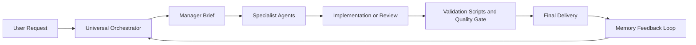
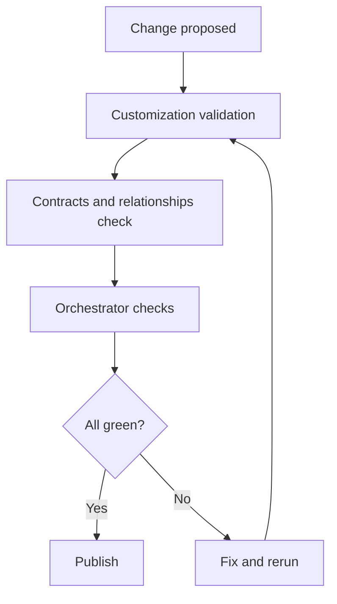

# Copilot-AI-Agent


Hub de personnalités Copilot orienté gouvernance : réutiliser vite, livrer proprement, garder le contrôle qualité, sécurité et conformité.

---

## Vision du projet

Ce dépôt est le socle maître pour industrialiser un système d'agents Copilot réutilisable sur plusieurs repositories.

Il fournit :

- une hiérarchie d'agents complète (orchestrateur, gouvernance, leads, workers),
- des règles de routage déterministes,
- des skills réutilisables pour les workflows complexes,
- des garde-fous de validation,
- une mémoire append-only pour améliorer le système dans le temps.

Objectif pratique : démarrer un nouveau repo avec des personnalités déjà prêtes en quelques minutes.

---

## Sommaire

- Architecture globale
- Structure du repo
- Catalogue détaillé des agents
- Règles opératoires et gouvernance
- Skills du système
- Mapping Agent vers Skill recommandé
- Routage rapide par type de demande
- Quick start et réutilisation rapide
- Validation et release gates
- Visual pack intégré
- FAQ
- Ownership et licence

---

## Architecture globale



---

## Structure du repo

```text
AGENTS.md                           # Contrat de fonctionnement principal
.github/copilot-instructions.md     # Règles globales Copilot
.github/agents/                     # 34 personnalités d'agents
.github/agent-registry.json         # Registre machine-readable des agents
.github/routing-rules.json          # Règles de routage par signaux/keywords
.github/instructions/               # Règles path-scopées (applyTo)
.github/skills/                     # 8 workflows métier réutilisables
.github/prompts/                    # Entrées de tâches réutilisables
.github/hooks/                      # Guardrails d'orchestration
.github/scripts/                    # Validation, audit, export, reporting
.github/memory/                     # Apprentissage append-only
docs/                               # Playbooks et guides opérationnels
docs/visuals/                       # Diagrammes Mermaid prêts à intégrer
examples/                           # Exemples de payloads, briefs, reports
```

---

## Catalogue détaillé des agents

### Niveau 0 : Orchestration centrale

- `Universal Orchestrator`
  - Rôle : chef d'orchestre global.
  - Responsabilités : classification, routage, manager brief, synthèse, quality gate, memory closeout.
  - Quand l'utiliser : par défaut pour toute demande multi-domaines ou critique.

### Niveau 1 : Gouvernance et pilotage

- `Chief of Staff`
  - Domaine : cadrage.
  - Mission : clarifier objectif, contraintes, done criteria, risques.
  - Sortie : manager brief exploitable.

- `Agent System Governor`
  - Domaine : système d'agents.
  - Mission : gouverner agents, prompts, skills, instructions, routage.
  - Sortie : changement gouvernance validé.

- `Memory Governor`
  - Domaine : mémoire.
  - Mission : gérer feedback loop, append-only memory, relay.
  - Sortie : mise à jour mémoire sûre et tracée.

- `Personality Evolution Governor`
  - Domaine : évolution des personas.
  - Mission : créer, tuner, fusionner des personnalités selon l'usage réel.
  - Sortie : proposition d'évolution avec preuves.

- `Delivery Lead`
  - Domaine : delivery.
  - Mission : coordonner l'implémentation multi-fichiers.
  - Sortie : livraison complète avec validation.

- `Quality Governor`
  - Domaine : qualité et release.
  - Mission : revue, tests, risque de régression, go/no-go release.
  - Sortie : recommandation release et risques résiduels.

### Niveau 2 : Leads de spécialité

- `Repo Explorer`
  - Discovery read-only.
  - Cartographie des impacts, fichiers et flux avant action.

- `Software Architect`
  - Architecture.
  - Protection des boundaries, contrats publics, scalabilité.

- `Programming Language Lead`
  - Ingénierie langage.
  - Routage vers le bon worker selon stack et tooling.

- `AI Architect`
  - LLM et prompting.
  - Qualité de routage IA, prompt, model, provider, evals.

- `Product Strategy Worker`
  - Product framing.
  - Clarifie workflow utilisateur, priorités, acceptance criteria.

### Niveau 3 : Workers d'exécution

- `Python Worker` : Python, debug, maintenabilité.
- `JavaScript TypeScript Worker` : JS/TS, Node, browser.
- `Frontend UI Worker` : layout, accessibilité, responsive UI.
- `Mobile App Worker` : iOS, Android, React Native, Flutter.
- `Backend API Worker` : API, services, intégrations.
- `Database Worker` : SQL, schéma, migrations, perf requêtes.
- `Debugger` : root cause, runtime failures, régressions.
- `Testing Worker` : tests, fixtures, couverture, non-régression.
- `Performance Optimizer` : latence, mémoire, coût.
- `Machine Learning Worker` : ML, features, évaluation, inference.
- `Data Finance Worker` : analytics, marchés, finance, formules.
- `Macro Economist Worker` : macro, données pays, sources officielles.
- `Research Worker` : recherche externe, qualité de sources, recency.
- `Security Worker` : sécurité, privacy, auth, secrets.
- `Dependency Supply Chain Worker` : dépendances, licences, CVE, lockfiles.
- `Legal Compliance Worker` : conformité, terms, réglementaire.
- `DevOps CI Worker` : CI/CD, GitHub Actions, déploiement.
- `Cloud Infrastructure Worker` : cloud, IaC, networking, environnements.
- `Observability Worker` : logs, metrics, tracing, alerting.
- `Documentation Worker` : README, runbooks, docs DX.
- `Automation Workflow Worker` : scripts, jobs planifiés, automatisation.
- `Translation Localization Worker` : traduction, terminologie, localisation.

---

## Règles opératoires et gouvernance

### Contrat opératoire essentiel

- Commencer par la réponse ou la décision.
- Préférer une solution validée à une explication longue.
- Ne jamais inventer des résultats de tests, des faits runtime, des chiffres ou des sources.
- Poser des questions uniquement si l'ambiguïté crée un risque réel.
- Ne jamais exposer secrets, tokens, clés privées ou données sensibles.

### Protocole Orchestrator

1. Charger le contexte (`AGENTS.md`, instructions Copilot, mémoire, guardrails).
2. Classifier la demande par domaine de risque.
3. Construire le manager brief (objectif, contraintes, non-goals, validation, risques).
4. Router au minimum d'agents nécessaire.
5. Réconcilier les sorties avec preuves.
6. Retourner une réponse validée ou expliciter l'incertitude restante.

### Quality gates clés

- Changement `.github` :
  `python .github/scripts/validate_copilot_customizations.py`
- Changement gouvernance, hooks, routing, memory :
  `python .github/scripts/run_orchestrator_checks.py`
- Python : `python -m py_compile <fichiers_touches>` ou commande projet plus forte.
- JS/TS : typecheck, lint, test du projet.

---

## Skills du système

Le repo contient 8 skills officiels dans `.github/skills/`.

- `agent-system-governance`
  - Usage : création et évolution agents, prompts, instructions, skills.
  - Workflow : charger contrat et scorecard, éviter duplication, valider customizations.
  - Output : changement gouvernance, validation, risque de drift.

- `code-review`
  - Usage : revue PR, patch, diff.
  - Workflow : inspecter comportement, tests, sécurité, perf, rollback path.
  - Output : findings priorisés, risques résiduels, recommandation release.

- `finance-market-analysis`
  - Usage : finance, marchés, macro, quant.
  - Workflow : hypothèses, formules, sources, validation des calculs.
  - Output : résultat, méthode, caveats.

- `memory-operations`
  - Usage : mémoire append-only, relay, feedback.
  - Workflow : classifier, safety gate, stocker durable, refresh profils.
  - Output : décision mémoire, privacy classification, validation evidence.

- `programming-language-work`
  - Usage : implémentation/refactor/debug code.
  - Workflow : identifier stack, choisir worker, patch minimal, valider.
  - Output : worker choisi, implémentation, validation, edge cases.

- `quality-release-gate`
  - Usage : gate qualité avant release.
  - Workflow : correctness, tests, sécurité, perf, maintenabilité.
  - Output : findings, validation, recommandation release.

- `research-and-verification`
  - Usage : recherche externe et vérification de faits.
  - Workflow : sources primaires, cross-check, safety gate.
  - Output : réponse sourcée, niveau de confiance, next step.

- `universal-super-delivery`
  - Usage : delivery end-to-end multi-domaines.
  - Workflow : manager brief, routing minimal, implémentation, validation, closeout.
  - Output : objectif atteint, fichiers modifiés, validation, risques et priorité suivante.

---

## Mapping Agent vers Skill recommandé

- `Universal Orchestrator` et `Delivery Lead` : `universal-super-delivery`
- `Agent System Governor` : `agent-system-governance`
- `Quality Governor` et `Testing Worker` : `quality-release-gate`, `code-review`
- `Programming Language Lead` et workers code : `programming-language-work`
- `Memory Governor` et `Personality Evolution Governor` : `memory-operations`
- `Data Finance Worker` et `Macro Economist Worker` : `finance-market-analysis`
- `Research Worker` : `research-and-verification`

---

## Routage rapide par type de demande

- Agents, prompts, skills, instructions, routing :
  - Owner : `Agent System Governor`
  - Validation : `python .github/scripts/validate_copilot_customizations.py`

- Mémoire, feedback, relay, provenance :
  - Owner : `Memory Governor`
  - Validation : `python .github/scripts/run_orchestrator_checks.py`

- Création et évolution de personnalités :
  - Owner : `Personality Evolution Governor`
  - Validation : `python .github/scripts/run_orchestrator_checks.py`

- Implémentation multi-fichiers :
  - Owner : `Delivery Lead`
  - Validation : tests natifs du projet

- Python :
  - Owner : `Python Worker`
  - Validation : `python -m py_compile` et tests projet

- JavaScript et TypeScript :
  - Owner : `JavaScript TypeScript Worker`
  - Validation : typecheck, lint, test

- API backend :
  - Owner : `Backend API Worker`
  - Validation : tests et import checks

- Database et SQL :
  - Owner : `Database Worker`
  - Validation : migrations et query checks

- Debug et régression :
  - Owner : `Debugger`
  - Validation : failing path verification

- Sécurité, auth, secrets :
  - Owner : `Security Worker`
  - Validation : risk verification

- CI/CD et workflows :
  - Owner : `DevOps CI Worker`
  - Validation : workflow validation

- Documentation :
  - Owner : `Documentation Worker`
  - Validation : cohérence commandes et paths

---

## Quick start et réutilisation rapide

### Boot local

```bash
git clone https://github.com/NAYTOUX/Copilot-AI-Agent.git
cd Copilot-AI-Agent
python .github/scripts/validate_copilot_customizations.py
python .github/scripts/run_orchestrator_checks.py
```

### Export vers un nouveau repo

```bash
python .github/scripts/export_agent_hub.py --target C:/path/to/target-repo
```

### Kit minimal à importer

- `AGENTS.md`
- `.github/copilot-instructions.md`
- `.github/agents/`
- `.github/instructions/`
- `.github/skills/`
- `.github/hooks/`
- `.github/memory/MEMORY_INDEX.md`
- `.github/memory/ORCHESTRATOR_ROUTING_SCORECARD.md`
- `.github/scripts/validate_copilot_customizations.py`

---

## Validation et release gates

```bash
python .github/scripts/validate_copilot_customizations.py
python .github/scripts/validate_json_contracts.py
python .github/scripts/validate_agent_relationships.py
python .github/scripts/run_orchestrator_checks.py
python .github/scripts/audit_agent_hub.py
python .github/scripts/prepare_release.py --allow-dirty
```



---

## Visual pack intégré

Diagrammes Mermaid prêts à intégrer :

- `docs/visuals/architecture.mmd`
- `docs/visuals/personality-reuse-flow.mmd`
- `docs/visuals/release-gate.mmd`
- `docs/visuals/governance-raci.mmd`
- `docs/visuals/memory-loop.mmd`

Usages recommandés : README, runbooks internes, Confluence ou Notion, deck onboarding.

---

## FAQ

### Ce repo est-il un framework applicatif ?

Non. C'est un hub de gouvernance, de routage et de réutilisation de personnalités d'agents.

### Puis-je l'utiliser tel quel dans tous mes projets ?

Oui pour la base, puis adapte les validations natives du repo cible.

### Par quoi commencer ?

`AGENTS.md`, puis `.github/copilot-instructions.md`.

### Quelle est la différence entre agents et skills ?

- Agents : qui exécute, avec ownership clair.
- Skills : comment exécuter, avec workflow standardisé.

### La licence est-elle permissive open source ?

Non. La licence est propriétaire non commerciale. Voir `LICENSE.md`.

---

## Ownership et licence

- Owner : Maxence Messarra
- GitHub : <https://github.com/NAYTOUX>
- Repository : <https://github.com/NAYTOUX/Copilot-AI-Agent>

Licence : `LICENSE.md` (Proprietary Non-Commercial License).

---

## TL;DR exécutif

Si tu veux un système d'agents Copilot réutilisable, gouverné, validé et scalable, ce repo est ton socle de référence.
